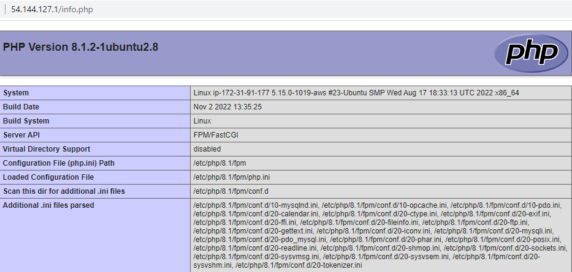
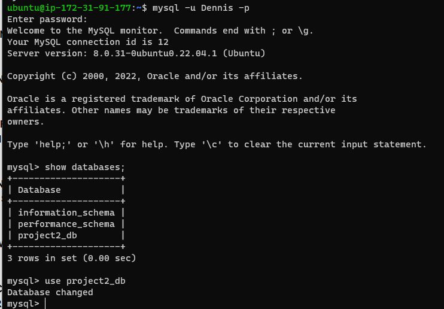
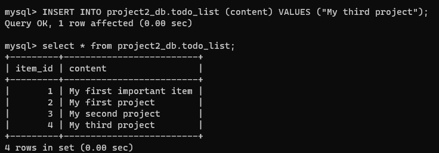
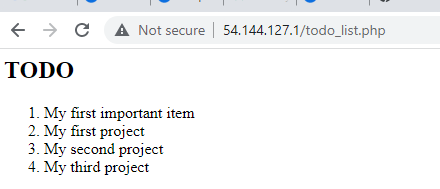

## Project 2 LEMP Implementation

`sudo apt update``sudo apt install nginx`
`sudo systemctl status nginx`

'curl -s http://54.144.127.1/latest/meta-data/public-ipv4'

'sudo apt install mysql-server`' sudo mysql-u root -p'

'http://`54.144.127.1`/info.php`

'CREATE DATABASE `project2_db`;`

'INSERT INTO project2_db.todo_list`'SELECT * FROM example_database.todo_list;'

'http://`54.144.127.1`/todo_list.php`
