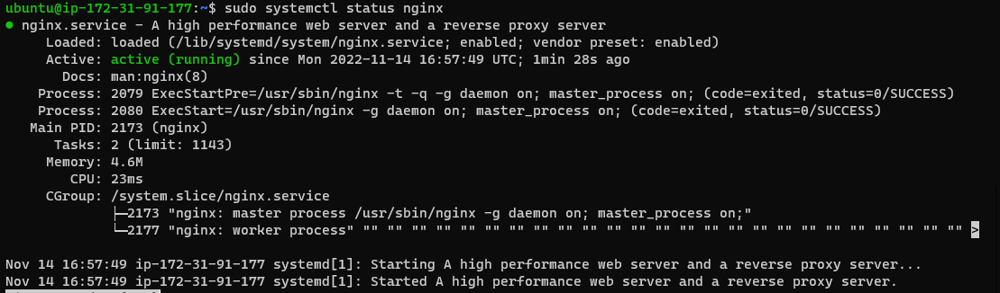
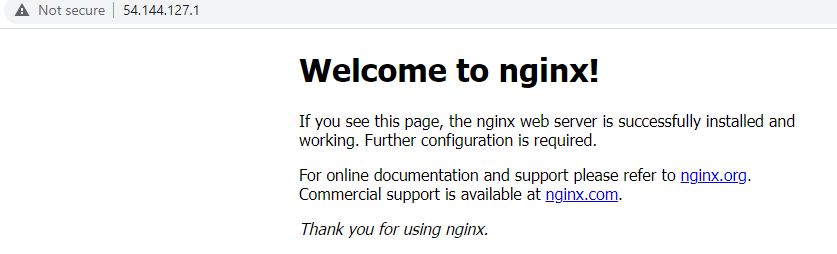
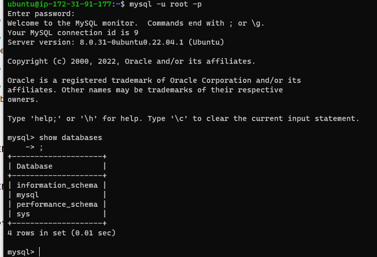

## Project 2 LEMP Implementation

`sudo apt update``sudo apt install nginx`
`sudo systemctl status nginx`

'curl -s http://54.144.127.1/latest/meta-data/public-ipv4'

'sudo apt install mysql-server`' sudo mysql-u root -p'
